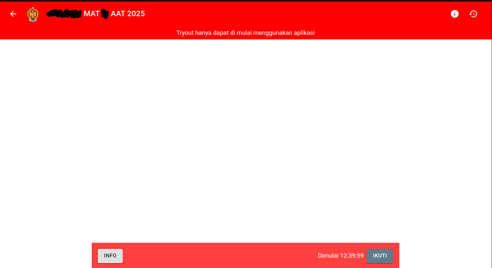
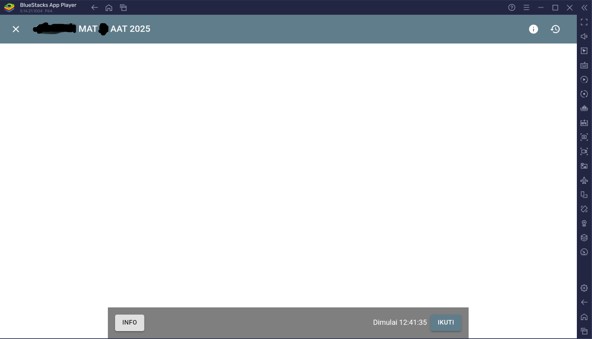

# geschool-hek-native 1.27
using "Geschool Secure Mode" in vm (virtual machine)
kalau mau make di hp utama pake di [colorful stage! ](https://github.com/nadchan/colorfulstage)
#### Before And after

<table>
  <tr>
    <td>tampilan tryout saat di web</td>
  </tr>
  <tr>
    <td></td>
  </tr>
 </table>
<table>
  <tr>
     <td>saat memasuki secure app vm</td>
  </tr>
  <tr>
    <td></td>
  </tr>
 </table>

## before memakai
- 1 . punya vm contoh [VM MASTER PLAYSTORE](https://play.google.com/store/apps/details?id=com.clone.android.dual.space&hl=en-US)
     tutorial masang vm : [link youtube ](https://www.youtube.com/watch?v=_Sb4YLj-G1s)
- 2 . jika sudah download lastest release di [lastest release](https://github.com/nadchan/geschool-hek-native/releases)
-  3 . selesai login geschool lewat browser di vm dan start app

## fitur
- support vm
  > klo support vm kan bisa keluar aplikasi vm nya simple kan klo mau banyak fiturnya make colorfulstage link di atas
- integrity and root spoofer thanks to [bypass integrity repo](https://github.com/aimardcr/APKKiller)
## Disclaimer
This repository is for educational purposes only.
